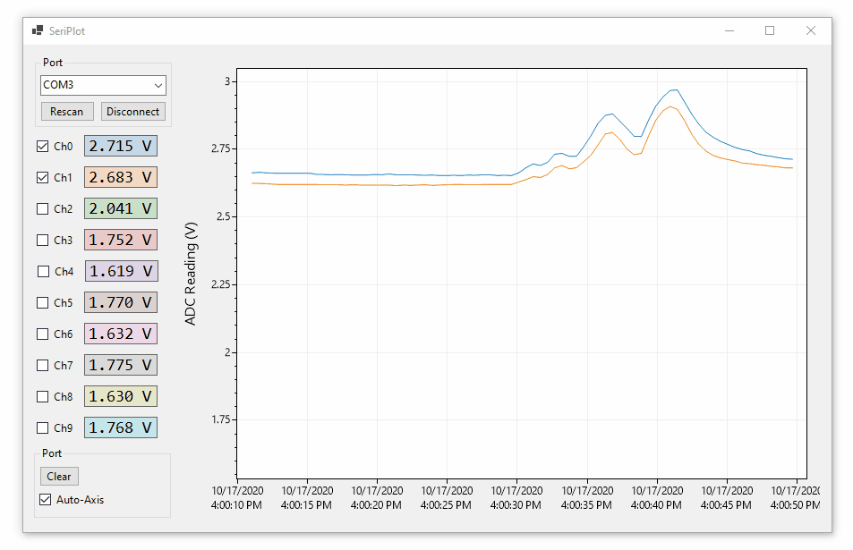

# ADC-10-F103C

**This repository is a collection of resources for the cheap 10-channel ADC boards available on the internet.** This module is based on a STM32 ([STM32F103C8T6](https://www.mouser.com/datasheet/2/389/cd00161566-1796535.pdf)) microcontroller and a [CH340](https://cdn.sparkfun.com/datasheets/Dev/Arduino/Other/CH340DS1.PDF) USB-to-serial adapter.

**Price:** I got my module for $13 on Amazon in 2020, but they are available on eBay for around $10.

**Accuracy, range, and sample rate:** This device measures 10 input voltages from ground to 3.3V using the STM32's 12-bit ADC. Voltage readings quantized into 4096 bins, each spanning 806 µV. Effective ADC resolution is 1-2 mV. Readings occur automatically on all 10 channels at ~1Hz.

**Software:** Any serial terminal will display data from this device. Official software is available but it's in Chinese. Default serial port settings are: 115200 baud, 8 bit frame, 1 stop bit, no flow control.

**No configuration required.** After providing power (through the USB port) the device immediately begins measuring and sending values over the serial port.

## Hardware

Front | Back
---|---
|

## Schematic

## Software

### RealTerm

I recommend using [RealTerm](https://sourceforge.net/projects/realterm/) configured to display ASCII at  using the settings in the screenshot. RealTerm allows serial data to be logged to a CSV file.

### ADC-10-F103C Plotter

**ADC-10-F103C Plotter is a Windows application that plots serial port data in real time.** This application is designed to be easy to modify to support custom data formats. Source code is MIT licensed so it can be adapted for commercial applications, and it is easy to distribute as a click-to-run Windows application. 

* **Download:** A click-to-run EXE can be downloaded from the [**Releases page**](releases)

* **Source:** ADC-10-F103C Plotter source code is in the [src](src) folder

* An alternative project is: https://github.com/swharden/SeriPlot

#### Free Software

* [SerialPlot](https://hg.sr.ht/~hyozd/serialplot/) - C++ and Qt
* [YAT (Yet Another Terminal)](https://sourceforge.net/projects/y-a-terminal/) - .NET, plotting supported (currently beta)
* [SerialLab](https://github.com/ahsayde/Serial-Lab) - C#, looks good, fixed format
* [ArduinoPlot](https://github.com/gregpinero/ArduinoPlot) - Python + Matplotlib
* [Arduino Plotter](https://github.com/devinaconley/arduino-plotter) - Arduino library
* [RealtimePlotter](https://github.com/sebnil/RealtimePlotter) - JavaScript
* RealTerm saving data + GnuPlot reloading the file
* [SimPlot](https://github.com/infomaniac50/projectsimplot) - Visual Basic program (binary available)
* [Telemetry](https://github.com/Overdrivr/Telemetry) Python + Qt (complex framed protocol)
* [Serial Chart](http://www.starlino.com/imu_kalman_arduino.html) - EXE, awkward configuration, crashed for me
* [Serial Monitor](https://github.com/hirohashi/SerialMonitor) - C++ source code only
* [RealTerm](https://sourceforge.net/projects/realterm/) - log a CSV while plotting it with another program

#### Commercial Software
* [MegunoLink](http://www.megunolink.com/) $29.95
* [MakerPlot](http://www.makerplot.com/) $39

#### Common Downsides
* Data format is often inflexible
* Arduino-specific JavaScript + Processing software
* Python GUI applications require complicated and brittle environments
* Not available as a click-to-run EXE

## Additional Resources

* Official documentation: [USB interface 10 channel 12Bit ADC data acquisition STM32 UA](http://www.chinalctech.com/m/view.php?aid=68)

* Software provided by my amazon seller: [clouddrive link](https://www.amazon.com/clouddrive/share/q6W9ZEHEHn6tpMZi6IiPf2KHRwzT9uaaVeGlQnNA26N)

* Microcontroller source code is available ([LC-ADC-F103C8_EN.zip](https://www.mediafire.com/file/8vl3qpv90vl98j4/LC-ADC-F103C8_EN.zip/file)) but it is a large, unorganized project of C and H files with Chinese comments.

* English documentation [LC-ADC-F103C8-manual.pdf](doc/LC-ADC-F103C8-manual.pdf)

* Schematic [ADC_10_F103C-schematic.pdf](doc/ADC_10_F103C-schematic.pdf)