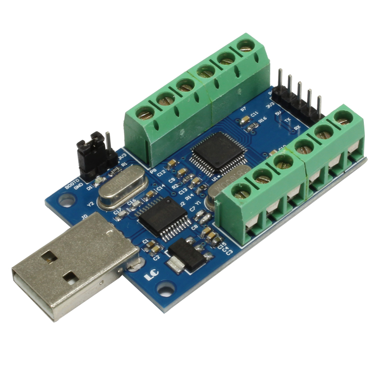
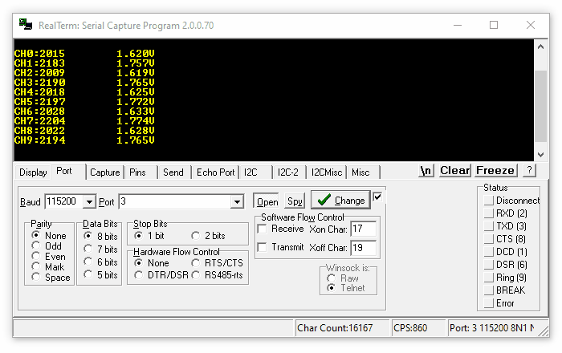
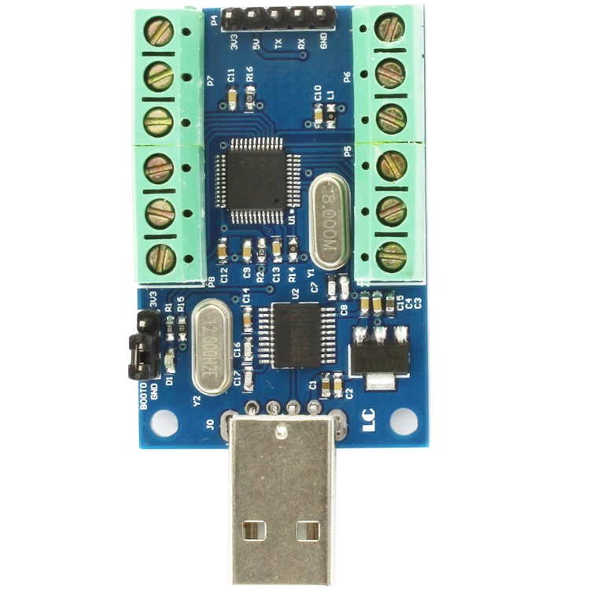
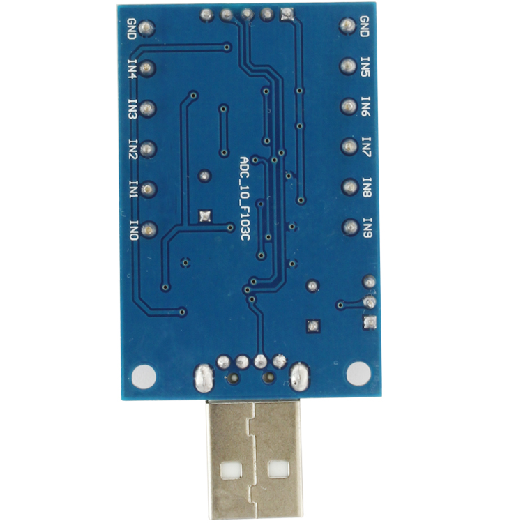
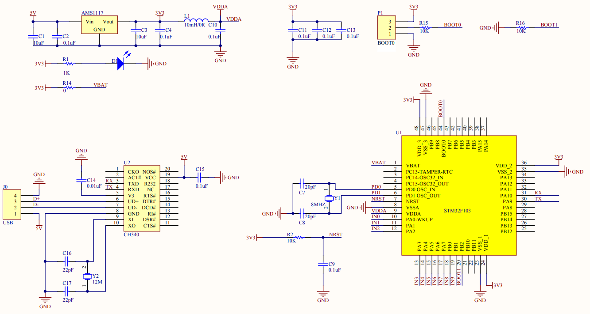

# ADC-10-F103C

**This repository is a collection of resources for the cheap 10-channel ADC boards available on the internet.** This module is based on a STM32 ([STM32F103C8T6](https://www.mouser.com/datasheet/2/389/cd00161566-1796535.pdf)) microcontroller and a [CH340](https://cdn.sparkfun.com/datasheets/Dev/Arduino/Other/CH340DS1.PDF) USB-to-serial adapter.

**Price:** I got my module for $13 on Amazon in 2020, but they are available on eBay for around $10.

**Accuracy, range, and sample rate:** This device measures 10 input voltages from ground to 3.3V using the STM32's 12-bit ADC. Voltage readings quantized into 4096 bins, each spanning 806 µV. Effective ADC resolution is 1-2 mV. Readings occur automatically on all 10 channels at ~1Hz.

**No configuration required.** After providing power (through the USB port) the device immediately begins measuring and sending values over the serial port.

**Software:** Any serial terminal will display data from this device. Official software is available but it's in Chinese. I recommend using [RealTerm](https://sourceforge.net/projects/realterm/) configured to display ASCII at 115200 baud using the settings in the screenshot. RealTerm allows serial data to be logged to a CSV file.

## Hardware

Front | Back
---|---
|

## Schematic

## Resources

* Official documentation: [USB interface 10 channel 12Bit ADC data acquisition STM32 UA](http://www.chinalctech.com/m/view.php?aid=68)

* Software provided by my amazon seller: [clouddrive link](https://www.amazon.com/clouddrive/share/q6W9ZEHEHn6tpMZi6IiPf2KHRwzT9uaaVeGlQnNA26N)

* Microcontroller source code is available ([LC-ADC-F103C8_EN.zip](https://www.mediafire.com/file/8vl3qpv90vl98j4/LC-ADC-F103C8_EN.zip/file)) but it is a large, unorganized project of C and H files with Chinese comments.

* English documentation [LC-ADC-F103C8-manual.pdf](doc/LC-ADC-F103C8-manual.pdf)

* Schematic [ADC_10_F103C-schematic.pdf](doc/ADC_10_F103C-schematic.pdf)